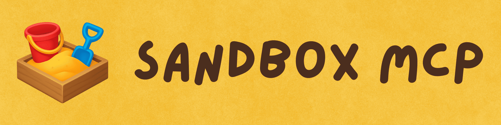
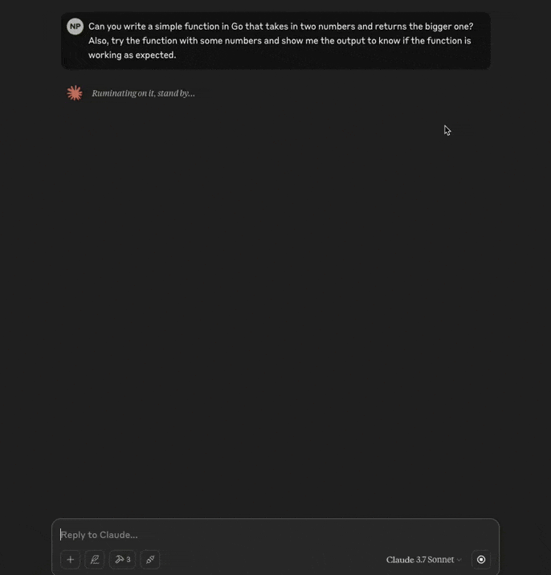

**Sandbox MCP** is a Model Context Protocol (MCP) server that enables LLMs (MCP hosts/clients) to **run code in secure, isolated Docker containers**.

While LLMs are really good at generating code, most **can't run the code they generate**. You end up running this untested code directly on your machine, which could have drastic unintended consequences.

Giving LLMs the tools to test the code safely prevents such issues and helps you **generate more accurate code in fewer iterations**.

Sandbox MCP gives the LLMs an **easy-to-use execution environment that anyone can create and configure** through a simple, AI-native MCP server that runs locally.

_Inspired by [Codapi](https://codapi.org). Some sandboxes are the same as [Codapi sandboxes](https://github.com/nalgeon/sandboxes)._

## Demo

This demo shows how Sandbox MCP works with Claude Desktop.



Try the [video](demo.mp4) if the GIF isn't clear.

## Installation

### Download Binary

You can download the appropriate binary for your operating system (for example, `Darwin`) and processor architecture (`arm64`) from the [Releases page](https://github.com/pottekkat/sandbox-mcp/releases) (`sandbox-mcp_Darwin_arm64.tar.gz`).

### Install via Go

Prerequisites:

- Go 1.24 or higher

```bash
go install github.com/pottekkat/sandbox-mcp/cmd/sandbox-mcp@latest
```

Get the path to the `sandbox-mcp` binary:

```bash
which sandbox-mcp
```

### Build from Source

See the [Development section](#development).

## Usage

### Initilization

Before you use `sandbox-mcp` with LLMs, you need to initialize its configuration:

```bash
# Create the configuration directory in
# $XDG_CONFIG_HOME/sandbox-mcp and pull
# the default sandboxes from GitHub
sandbox-mcp --pull

# Build the Docker images for the sandboxes
sandbox-mcp --build
```

> [!NOTE]
> Make sure you have Docker installed and running.

### With MCP Hosts/Clients

Add this to your `claude_desktop_config.json` for Claude Desktop or `mcp.json` for Cursor IDE:

```json
{
    "mcpServers": {
        "sandbox-mcp": {
            "command": "path/to/sandbox-mcp",
            "args": [
                "--stdio"
            ]
        }
    }
}
```

> [!NOTE]
> Make sure to replace `path/to/sandbox-mcp` with the actual path to the `sandbox-mcp` binary.

## Available Sandboxes

### shell

Run shell commands in a Linux environment with strict security and network constraints.

### python

Run Python code with a set of pre-installed libraries.

> [!IMPORTANT]
> ### Your Own Sandbox
> 
> You can create and add your own sandboxes in `$XDG_CONFIG_HOME/sandbox-mcp/sandboxes`. A sandbox is essentially a Dockerfile and a JSON configuration. Check out the [examples and the guide](/sandboxes) to learn more.

### network-tools

Use various network tools in an isolated Linux sandbox. The container has network access.

See [jonlabelle/docker-network-tools](https://github.com/jonlabelle/docker-network-tools) for a list of available tools.

### go

Run simple Go code in an isolated sandbox.

### javascript

Run JavaScript code using Node.js.

## Development

Fork and clone the repository:

```bash
git clone https://github.com/username/sandbox-mcp.git
```

Change into the directory:

```bash
cd sandbox-mcp
```

Install dependencies:

```bash
make deps
```

Build the project:

```bash
make build
```

Update your MCP servers configuration to point to the local build:

```json
{
    "mcpServers": {
        "sandbox-mcp": {
            "command": "/path/to/sandbox-mcp/dist/sandbox-mcp",
            "args": [
                "--stdio"
            ]
        }
    }
}
```

## License

[MIT License](LICENSE)
